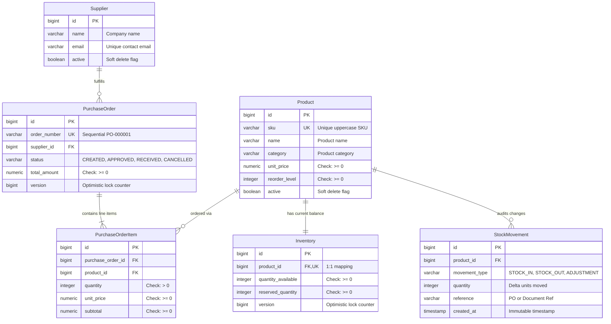
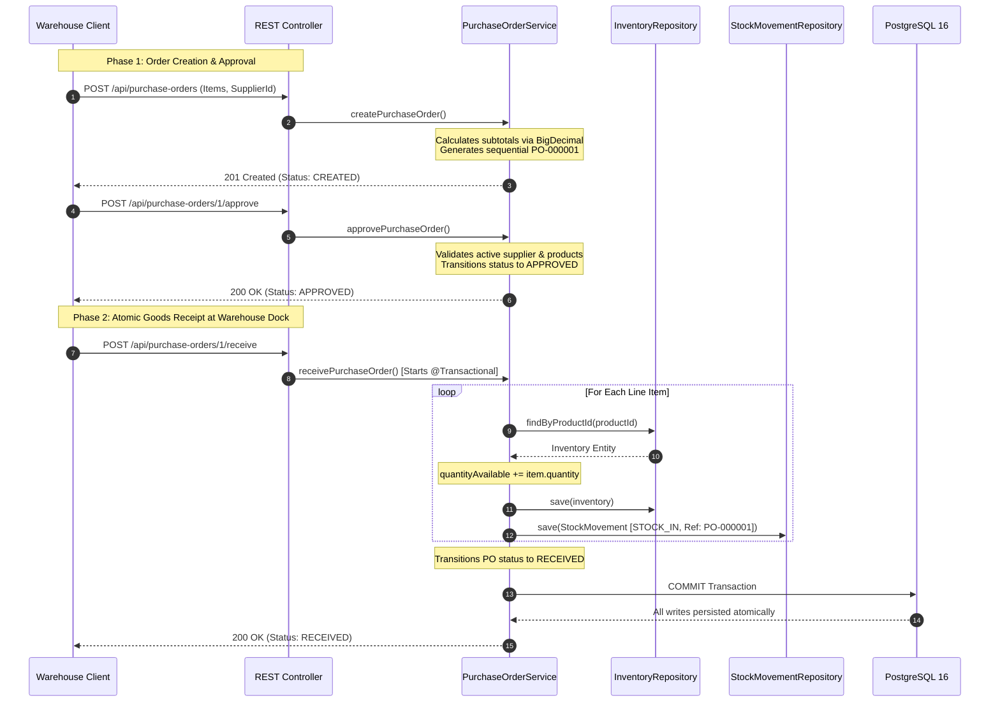

# FactoryOS — Industrial Inventory & Purchasing Management System

FactoryOS is a robust, production-grade backend and operations dashboard designed for industrial manufacturing environments. It orchestrates product catalogs, supplier registries, real-time warehouse inventory, immutable movement audit trails, and multi-item procurement workflows with strict ACID transactional guarantees.

Built with **Java 21**, **Spring Boot 3.4**, **PostgreSQL 16**, **JPA / Hibernate**, and **React**, the application demonstrates modern enterprise backend design principles: strict separation of concerns, DTO boundaries, database-level invariant enforcement, optimistic concurrency control, centralized exception handling, and comprehensive automated testing.

---

## Features

### Product Catalog Management

- **Full CRUD with RESTful Semantics**: Product registration, catalog lookup, search by name substring, and active status filtering.
- **SKU Uniqueness & Normalization**: Stock Keeping Unit (SKU) codes are normalized to uppercase, trimmed, and enforced as globally unique at both application and database engine levels.
- **Soft Deactivation Policy**: Deactivating a product (`active = false`, HTTP 204) preserves historical integrity; past stock movements and purchase orders referencing the product are never orphaned or deleted.
- **Monetary Precision**: Authoritative financial calculations using `BigDecimal` (`precision = 12, scale = 2`) to avoid binary floating-point rounding errors.

### Supplier Directory

- **Supplier Onboarding & Directory**: Manage industrial vendors with contact person, phone, address, and unique corporate email validation.
- **Lifecycle Status Control**: Soft deactivation allows retiring suppliers without breaking historical procurement audit records.

### Real-Time Inventory & Stock Movement Auditing

- **1:1 Materialized Inventory Mapping**: Each product is mapped to a dedicated `Inventory` record tracking current available stock (`quantityAvailable`) and reserved quantities.
- **Negative-Stock Prevention**: Stock-out requests (`POST /api/inventory/stock-out`) strictly verify that `quantityAvailable >= requestedQuantity`. Insufficient stock triggers an immediate HTTP 409 Conflict.
- **Immutable Audit Movement Trail**: Every balance-altering operation (`STOCK_IN`, `STOCK_OUT`, `ADJUSTMENT`) generates an append-only `StockMovement` entry with reference IDs, reasons, and timestamps.
- **Database-Side Low-Stock Alerts**: Real-time evaluation of low stock (`quantityAvailable <= reorderLevel`) queried directly in PostgreSQL for maximum efficiency.

### Procurement & Purchase Order Lifecycle

- **Multi-Item Procurement**: Create purchase orders referencing active suppliers and multiple distinct line items with historical unit price snapshots.
- **Sequential Order Numbering**: Automatic generation of human-readable, sequential identifiers (`PO-000001`, `PO-000002`).
- **Domain State Machine**: Strict lifecycle state transitions:
  ```text
  CREATED ──► APPROVED ──► RECEIVED
     │           │
     ▼           ▼
  CANCELLED   CANCELLED
  ```
- **Atomic Goods Receipt**: Receiving an approved order (`POST /api/purchase-orders/{id}/receive`) executes inside an atomic `@Transactional` service boundary:
  1. Increments `quantityAvailable` for every line item.
  2. Generates individual `STOCK_IN` movement records referencing the order number.
  3. Transitions order status to `RECEIVED`.
  4. If any single item update fails, the entire transaction **rolls back completely**—zero partial stock increments, zero orphaned movements.
- **Terminal State Immutability**: Orders in `RECEIVED` or `CANCELLED` states cannot be modified or transitioned further.

### Production Hardening & Code Quality

- **Safe DDL Validation**: Production profile enforces `spring.jpa.hibernate.ddl-auto=validate`, guaranteeing the application never silently alters database schemas at startup.
- **Optimistic Concurrency Control**: `@Version` fields on `Inventory` and `PurchaseOrder` guard against race conditions during concurrent write operations.
- **CORS Protection**: Dynamic origin validation via `@ConfigurationProperties`, rejecting unauthorized origins with HTTP 403 Forbidden without wildcard exposure.
- **Interactive OpenAPI 3.1 & Swagger UI**: Available at `/swagger-ui/index.html` with detailed schema descriptions and domain rule explanations.

---

## Technology Stack

| Technology                | Layer / Purpose           | Architectural Justification                                                                                |
| :------------------------ | :------------------------ | :--------------------------------------------------------------------------------------------------------- |
| **Java 21 LTS**           | Core Language             | Leverages immutable Java Records for DTOs, pattern matching, and modern JVM performance.                   |
| **Spring Boot 3.4.3**     | Application Framework     | Industry-standard enterprise framework providing IoC, declarative transactions, and rapid configuration.   |
| **Spring Data JPA**       | Data Access               | Eliminates boilerplate persistence code while supporting type-safe repository queries and JPQL.            |
| **Hibernate ORM 6.x**     | Object-Relational Mapping | Manages entity lifecycles, dirty checking, optimistic locking (`@Version`), and schema validation.         |
| **PostgreSQL 16**         | Relational Database       | ACID-compliant storage with foreign key constraints, unique B-tree indexes, and table `CHECK` constraints. |
| **Jakarta Validation**    | Request Validation        | Declarative input boundary defense (`@NotNull`, `@NotBlank`, `@Positive`, `@Size`, `@Valid`).              |
| **Springdoc OpenAPI 3.1** | API Documentation         | Generates interactive Swagger UI and OpenAPI JSON specs directly from code and annotations.                |
| **JUnit 5 & Mockito**     | Automated Testing         | Unit testing business rules with fast mocks; verifying exception states and side effects.                  |
| **MockMvc**               | Web Layer Testing         | Controller slice testing (`@WebMvcTest`) for HTTP routing, validation errors, and JSON envelopes.          |
| **JaCoCo (0.8.12)**       | Code Coverage             | Enforces test depth across services, controllers, entities, and configurations (**86% coverage**).         |
| **Vite + React 18**       | Frontend Dashboard        | Operations desktop dashboard with Lucide icons, responsive navigation, and live API binding.               |

---

## System Architecture

FactoryOS follows a strict **Layered Architecture** where dependencies flow inward. Higher layers depend on lower-layer abstractions, and persistence entities are strictly prevented from leaking into external API contracts.

```mermaid
graph TD
    Client["Client Applications<br/>(React UI / REST Consumers)"]

    subgraph SpringBootApp ["FactoryOS Spring Boot 3.4 Application"]
        subgraph WebLayer ["Presentation & Web Layer"]
            Controllers["REST Controllers<br/>(Product, Supplier, Inventory, PO, Health)"]
            Validation["Jakarta Validation<br/>(@Valid, @NotNull, @Positive, @Size)"]
            ExceptionHandler["Global Exception Handler<br/>(@RestControllerAdvice)"]
        end

        subgraph ServiceLayer ["Business & Domain Logic Layer"]
            Services["Domain Services<br/>(ProductService, SupplierService,<br/>InventoryService, PurchaseOrderService)"]
            Transactions["Transaction Manager<br/>(@Transactional Boundaries)"]
            Concurrency["Optimistic Concurrency<br/>(@Version Locking)"]
            Mappers["DTO Mappers<br/>(Record Mappings)"]
        end

        subgraph PersistenceLayer ["Data Access Layer"]
            Repositories["Spring Data Repositories<br/>(JpaRepository + JPQL)"]
            Hibernate["Hibernate ORM 6.x<br/>(Entity Lifecycle & Dirty Checking)"]
        end
    end

    subgraph DatabaseLayer ["PostgreSQL 16 Relational Engine"]
        Postgres["PostgreSQL Database Tables<br/>(products, suppliers, inventory,<br/>purchase_orders, purchase_order_items, stock_movements)"]
        Constraints["Database Constraints<br/>(Foreign Keys, Unique Indexes, @Check Constraints)"]
    end

    Client -->|HTTP / JSON Requests| Controllers
    Controllers --> Validation
    Controllers -->|Validated DTO Records| Services
    Services --> Mappers
    Services --> Transactions
    Services --> Concurrency
    Services -->|JPA Entities| Repositories
    Repositories --> Hibernate
    Hibernate -->|JDBC SQL Queries| Postgres
    Postgres --> Constraints
    ExceptionHandler -.->|Sanitized ErrorResponse (4xx / 500)| Client
```

### Request & DTO Lifecycle

To prevent mass-assignment vulnerabilities and eliminate ORM lazy-loading anomalies, JPA entities are never returned to clients:

```text
HTTP Request (JSON)
     ↓
Controller Layer: Jakarta Validation (@Valid RequestRecord)
     ↓
Service Layer: Domain Invariant Evaluation & Transaction Boundary (@Transactional)
     ↓
Repository Layer: Load / Persist JPA Entities
     ↓
Database: SQL Execution & Engine-Level Constraint Checks
     ↓
Mapper: Transform Mutated JPA Entity → Immutable ResponseRecord (DTO)
     ↓
Controller Layer: Wrap in ResponseEntity (HTTP 200, 201, 204)
     ↓
HTTP Response (JSON)
```

---

## Domain Model & Database Design

### Entity-Relationship Diagram (ERD)



### Relational Design Decisions

1. **Product vs. Inventory Separation**:
   - `Product` captures descriptive catalog metadata (name, SKU, specifications, pricing, reorder thresholds).
   - `Inventory` captures volatile warehouse state (`quantity_available`, `reserved_quantity`).
   - _Rationale_: Isolates high-frequency stock mutations from catalog queries; enables multi-warehouse expansion without modifying the core product catalog schema.
2. **Current State vs. Audit Log Separation**:
   - `Inventory` maintains the materialized balance for instantaneous O(1) stock checks.
   - `StockMovement` maintains an append-only, immutable transaction log of all historical inventory adjustments.
   - _Rationale_: Eliminates expensive runtime aggregations (`SUM(deltas)`) while preserving complete audit compliance.
3. **Associative Line Items (`PurchaseOrderItem`)**:
   - Models the Many-to-Many relationship between `PurchaseOrder` and `Product`.
   - Snapshots the agreed `unit_price` at the moment of order creation, protecting historical accounting records from future catalog price adjustments.

---

## Key Business Workflows

### 1. Purchase Order Procurement & Goods Receipt Lifecycle



**Rollback Guarantee on Mid-Transaction Failure**:
If any line item fails validation (e.g., an inactive product or database constraint violation), Spring issues an immediate database `ROLLBACK`. All inventory increments in that loop are reverted, no movement records are created, and the purchase order status remains `APPROVED`.

### 2. Real-Time Inventory Operations

- **Stock-In (`POST /api/inventory/stock-in`)**: Increments warehouse stock and creates a `STOCK_IN` movement referencing delivery manifests.
- **Stock-Out with Negative Stock Guard (`POST /api/inventory/stock-out`)**:
  - Validates `quantityAvailable >= requestedQuantity`.
  - If stock is sufficient: decrements inventory and logs a `STOCK_OUT` movement.
  - If stock is insufficient: aborts transaction and returns HTTP `409 Conflict` (`InsufficientStockException`).
- **Physical Count Adjustment (`POST /api/inventory/adjust`)**: Reconciles warehouse inventory to physical cycle counts, computing the mathematical delta and logging an `ADJUSTMENT` movement.

---

## API Documentation & Reference

Interactive documentation is served via OpenAPI 3.1 and Swagger UI:

- **Swagger UI**: [http://localhost:8080/swagger-ui/index.html](http://localhost:8080/swagger-ui/index.html)
- **OpenAPI 3.1 Specification**: [http://localhost:8080/v3/api-docs](http://localhost:8080/v3/api-docs)

### Core REST Endpoints

| Domain              |  Method  | Endpoint                            | Description                                             | Status Codes               |
| :------------------ | :------: | :---------------------------------- | :------------------------------------------------------ | :------------------------- |
| **Products**        |  `POST`  | `/api/products`                     | Register product (enforces unique SKU)                  | `201`, `400`, `409`        |
|                     |  `GET`   | `/api/products`                     | List all catalog products                               | `200`                      |
|                     |  `GET`   | `/api/products/{id}`                | Retrieve product by ID                                  | `200`, `404`               |
|                     |  `GET`   | `/api/products/active`              | List active products eligible for orders                | `200`                      |
|                     |  `GET`   | `/api/products/search?name=...`     | Case-insensitive product name search                    | `200`                      |
|                     |  `PUT`   | `/api/products/{id}`                | Update product details (SKU immutable)                  | `200`, `400`, `404`        |
|                     | `DELETE` | `/api/products/{id}`                | Soft-deactivate product (`active=false`)                | `204`, `404`               |
| **Suppliers**       |  `POST`  | `/api/suppliers`                    | Register new industrial supplier                        | `201`, `400`, `409`        |
|                     |  `GET`   | `/api/suppliers`                    | List all suppliers                                      | `200`                      |
|                     |  `GET`   | `/api/suppliers/{id}`               | Retrieve supplier by ID                                 | `200`, `404`               |
|                     |  `GET`   | `/api/suppliers/active`             | List active suppliers                                   | `200`                      |
|                     |  `PUT`   | `/api/suppliers/{id}`               | Update supplier profile and contacts                    | `200`, `400`, `404`        |
|                     | `DELETE` | `/api/suppliers/{id}`               | Soft-deactivate supplier                                | `204`, `404`               |
| **Inventory**       |  `GET`   | `/api/inventory`                    | Real-time stock status across all items                 | `200`                      |
|                     |  `GET`   | `/api/inventory/{productId}`        | Stock details and low-stock indicator                   | `200`, `404`               |
|                     |  `POST`  | `/api/inventory/stock-in`           | Physical receipt stock-in                               | `200`, `400`, `404`        |
|                     |  `POST`  | `/api/inventory/stock-out`          | Dispatch stock-out (guarded against negative balance)   | `200`, `400`, `404`, `409` |
|                     |  `POST`  | `/api/inventory/adjust`             | Physical count adjustment                               | `200`, `400`, `404`        |
|                     |  `GET`   | `/api/inventory/low-stock`          | Items where `quantityAvailable <= reorderLevel`         | `200`                      |
|                     |  `GET`   | `/api/inventory/{id}/movements`     | Chronological audit trail for product                   | `200`, `404`               |
| **Purchase Orders** |  `POST`  | `/api/purchase-orders`              | Create multi-item order (Status: `CREATED`)             | `201`, `400`, `404`        |
|                     |  `GET`   | `/api/purchase-orders`              | Summary list of all orders                              | `200`                      |
|                     |  `GET`   | `/api/purchase-orders/{id}`         | Full order details with line items                      | `200`, `404`               |
|                     |  `POST`  | `/api/purchase-orders/{id}/approve` | Transition order status `CREATED -> APPROVED`           | `200`, `404`, `409`        |
|                     |  `POST`  | `/api/purchase-orders/{id}/receive` | Atomic receipt, stock increment, `APPROVED -> RECEIVED` | `200`, `404`, `409`        |
|                     |  `POST`  | `/api/purchase-orders/{id}/cancel`  | Abort order (`CREATED/APPROVED -> CANCELLED`)           | `200`, `404`, `409`        |
| **System**          |  `GET`   | `/api/health`                       | Service health status                                   | `200`                      |

### Standardized Error Envelope (`ErrorResponse`)

All error responses return a uniform JSON structure without leaking internal database schemas or server stack traces:

```json
{
  "timestamp": "2026-09-11T16:11:14.515Z",
  "status": 409,
  "error": "Insufficient Stock",
  "message": "Cannot remove 20 units of PMP-001. Available stock: 15",
  "path": "/api/inventory/stock-out"
}
```

---

## Project Structure

```text
FactoryOS
├── .docs/                             # Engineering documentation & walkthroughs
│   ├── interview-questions.md         # 30+ categorized technical interview Q&A
│   ├── resume-project-description.md  # Resume bullet points & portfolio pitch
│   └── walkthroughs/                  # Phase-by-phase implementation logs
├── docs/                              # Visual documentation
│   ├── architecture.md                # System architecture & sequence diagrams
│   └── database-schema.md             # Entity-Relationship diagram & constraint details
├── frontend/                          # Vite + React Operations Dashboard
│   ├── src/
│   │   ├── api/                       # Centralized Axios API client
│   │   ├── components/                # Reusable UI cards, tables, badges, modals
│   │   └── views/                     # Dashboard, Products, Suppliers, Inventory, POs
│   └── package.json
├── src/
│   ├── main/
│   │   ├── java/com/factoryos/
│   │   │   ├── config/                # CORS, OpenAPI, Properties, Dev Demo Seeder
│   │   │   ├── controller/            # REST Controllers (Jakarta @Valid, OpenAPI)
│   │   │   ├── dto/                   # Immutable Java 21 Record DTOs
│   │   │   ├── entity/                # JPA Entities (@Check, @Version, @Table)
│   │   │   ├── exception/             # Custom Exceptions & GlobalExceptionHandler
│   │   │   ├── mapper/                # DTO-to-Entity & Entity-to-DTO Mappers
│   │   │   ├── repository/            # Spring Data Repositories & JPQL Queries
│   │   │   └── service/               # Domain Business Logic & @Transactional Services
│   │   └── resources/
│   │       ├── application.properties # Baseline defaults & environment variable overrides
│   │       └── application-prod.properties # Production profile (ddl-auto=validate)
│   └── test/                          # 116 Automated Tests
│       └── java/com/factoryos/
│           ├── config/                # Property validation & CORS tests
│           ├── controller/            # WebMvc slice tests (MockMvc)
│           ├── exception/             # Global exception translation tests
│           ├── integration/           # Integration tests & transaction rollback proof
│           └── service/               # Domain unit tests (Mockito)
├── .env.example                       # Environment configuration template
├── .gitignore                         # Secret and build artifact exclusions
├── pom.xml                            # Maven project build configuration
└── README.md                          # Repository documentation
```

---

## Getting Started

### Prerequisites

- **Java 21 LTS** (`openjdk-21-jdk`)
- **Maven 3.9+** (or included `./mvnw` wrapper)
- **PostgreSQL 16** running locally or via container
- **Node.js 20+** & **npm** (for the frontend dashboard)

### 1. Database Setup

Create the PostgreSQL database:

```sql
CREATE DATABASE factoryos;
```

### 2. Environment Configuration

Copy the configuration template to `.env`:

```bash
cp .env.example .env
```

Ensure your credentials match your local PostgreSQL instance:

```properties
DB_URL=jdbc:postgresql://localhost:5432/factoryos
DB_USERNAME=postgres
DB_PASSWORD=postgres
SERVER_PORT=8080
CORS_ALLOWED_ORIGINS=http://localhost:5173
```

### 3. Run Automated Tests

Execute the entire test suite:

```bash
./mvnw clean test
```

### 4. Start Backend Server

Run the Spring Boot application:

```bash
./mvnw spring-boot:run
```

The backend initializes on port `8080` (`http://localhost:8080`).

- By default, the `dev` profile is active (`spring.profiles.default=dev`).
- The development seeder automatically populates sample products, suppliers, inventory counts, and purchase orders on startup.
- Access Swagger UI at `http://localhost:8080/swagger-ui/index.html`.

### 5. Start Frontend Dashboard

In a separate terminal window:

```bash
cd frontend
npm install
npm run dev
```

Open your browser at `http://localhost:5173` to access the live operations dashboard.

---

## Environment Configuration Matrix

All operational settings are externalized to environment variables for seamless container and cloud deployment:

| Variable                 | Description                      | Development Default                          | Production Recommendation              |
| :----------------------- | :------------------------------- | :------------------------------------------- | :------------------------------------- |
| `SPRING_PROFILES_ACTIVE` | Active Spring profile            | `dev`                                        | `prod`                                 |
| `SERVER_PORT`            | HTTP server port                 | `8080`                                       | `8080` or container-specified port     |
| `DB_URL`                 | PostgreSQL JDBC connection URL   | `jdbc:postgresql://localhost:5432/factoryos` | Managed PostgreSQL endpoint with SSL   |
| `DB_USERNAME`            | Database username                | `postgres`                                   | Dedicated application user             |
| `DB_PASSWORD`            | Database password                | `postgres`                                   | Injected via secrets vault             |
| `JPA_DDL_AUTO`           | Hibernate schema management      | `update` (dev)                               | `validate` (schema managed externally) |
| `CORS_ALLOWED_ORIGINS`   | Permitted client browser origins | `http://localhost:5173`                      | Exact production frontend URL          |
| `SWAGGER_ENABLED`        | OpenAPI docs & Swagger UI toggle | `true`                                       | `false`                                |

---

## Testing & Quality Assurance

FactoryOS maintains a multi-tiered test pyramid ensuring business logic integrity across all architectural layers. The automated suite contains **116 automated tests** with 0 failures and 0 errors:

```text
[INFO] Results:
[INFO]
[INFO] Tests run: 116, Failures: 0, Errors: 0, Skipped: 0
[INFO]
[INFO] ------------------------------------------------------------------------
[INFO] BUILD SUCCESS
[INFO] ------------------------------------------------------------------------
```

### JaCoCo Code Coverage Summary

```text
Total Instruction Coverage: 86%
Total Classes Analyzed: 55

com.factoryos.config       : 100%
com.factoryos.dto          : 100%
com.factoryos.controller   : 89%
com.factoryos.service      : 89%
com.factoryos.exception    : 84%
com.factoryos.entity       : 79%
com.factoryos.service.impl : 74%
com.factoryos.mapper       : 74%
```

### Key Highlight: Atomic Transaction Rollback Proof

In `PurchaseOrderReceivingIntegrationTest`, the test `receivePurchaseOrder_whenItemFails_rollsBackEntireTransactionAtomically` verifies ACID transaction atomicity against real PostgreSQL:

1. Configures a purchase order with multiple items.
2. Injects a failure condition on a subsequent item midway through goods receipt.
3. Asserts that previous inventory increments are completely reverted to their original values.
4. Asserts that all generated `STOCK_IN` movement records are removed from the database.
5. Asserts that the purchase order status remains `APPROVED`, proving that partial updates are impossible.

---

## Key Technical Decisions

1. **Java Records for DTOs**:
   - Used for all request and response models. Records guarantee immutability, thread safety, clean syntax, and seamless integration with Jakarta Bean Validation.
2. **DTO / Entity Separation**:
   - Entities never cross controller boundaries. This protects against mass-assignment vulnerabilities, eliminates Jackson circular serialization recursion, and keeps the database schema decoupled from external API contracts.
3. **Database-Level Invariant Enforcement (`@Check`)**:
   - Critical industrial invariants (non-negative stock, non-negative unit prices, positive quantities) are enforced directly in PostgreSQL via table `CHECK` constraints, providing defense-in-depth even if data is modified via direct SQL.
4. **Optimistic Locking with `@Version`**:
   - Applied to `Inventory` and `PurchaseOrder`. Mitigates race conditions during high-frequency concurrent operations without acquiring heavy database table locks. Stale updates trigger a clear HTTP 409 Conflict.
5. **Authoritative Monetary Precision (`BigDecimal`)**:
   - All unit prices, line-item subtotals, and purchase order totals use `BigDecimal` with `RoundingMode.HALF_UP`, preventing floating-point rounding discrepancies.
6. **Soft Deactivation Over Physical Deletes**:
   - Deactivating products or suppliers preserves referential integrity. Historical audit records, movement trails, and past procurement orders remain accurate and intact.

---

## Future Improvements

- **Authentication & Role-Based Access Control (RBAC)**: Integrating Spring Security with JWT or OAuth2 for granular permissions (e.g. Warehouse Clerk, Procurement Manager, Plant Admin).
- **Automated Database Migrations**: Introducing Flyway or Liquibase for version-controlled, production-safe schema migrations.
- **Batch Barcode & Serial Tracking**: Extending `StockMovement` to track individual serialized machinery components and barcode scans.
- **Export & Reporting**: Automated PDF purchase order generation and CSV exports for warehouse inventory audits.
