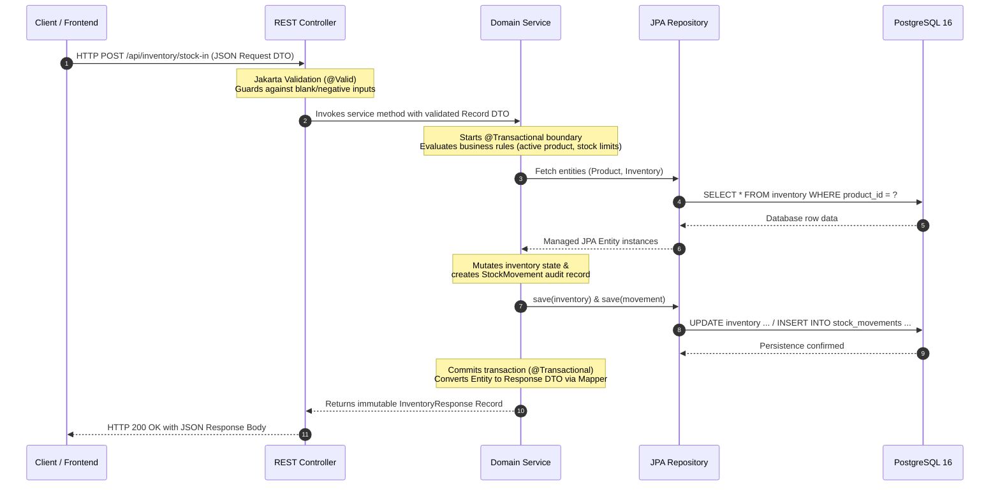

# FactoryOS — Architecture & Design Guide

## 1. System Architecture Diagram

```mermaid
graph TD
    Client["Client Applications<br/>(React Web UI / REST Consumers)"]

    subgraph SpringBootApp ["FactoryOS Spring Boot 3.4 Application"]
        subgraph WebLayer ["Presentation & Web Layer"]
            Controllers["REST Controllers<br/>(Product, Supplier, Inventory, PO, Health)"]
            Validation["Jakarta Validation<br/>(@Valid, @NotNull, @Positive, @Size)"]
            ExceptionHandler["Global Exception Handler<br/>(@RestControllerAdvice)"]
        end

        subgraph ServiceLayer ["Business & Domain Logic Layer"]
            Services["Services<br/>(ProductService, SupplierService,<br/>InventoryService, PurchaseOrderService)"]
            Transactions["Transaction Manager<br/>(@Transactional Boundaries)"]
            Concurrency["Optimistic Concurrency<br/>(@Version Locking)"]
            Mappers["DTO Mappers<br/>(MapStruct / Record Mappings)"]
        end

        subgraph PersistenceLayer ["Data Access Layer"]
            Repositories["Spring Data Repositories<br/>(JpaRepository + JPQL)"]
            Hibernate["Hibernate ORM 6.x<br/>(Entity Lifecycle & Dirty Checking)"]
        end
    end

    subgraph DatabaseLayer ["PostgreSQL 16 Database"]
        Postgres["PostgreSQL Tables<br/>(products, suppliers, inventory,<br/>purchase_orders, purchase_order_items, stock_movements)"]
        Constraints["Engine Constraints<br/>(Foreign Keys, Unique Indexes, @Check)"]
    end

    Client -->|HTTP / JSON Requests| Controllers
    Controllers --> Validation
    Controllers -->|Domain DTOs| Services
    Services --> Mappers
    Services --> Transactions
    Services --> Concurrency
    Services -->|Entities| Repositories
    Repositories --> Hibernate
    Hibernate -->|SQL / JDBC Connections| Postgres
    Postgres --> Constraints
    ExceptionHandler -.->|Sanitized ErrorResponse (4xx / 500)| Client
```

---

## 2. Request & DTO Flow Lifecycle

FactoryOS strictly decouples external API representations from internal JPA entities. The lifecycle of a typical request flows as follows:



---

## 3. Layer Responsibilities Summary

| Layer                              | Primary Responsibilities                                                                                                                                                 | Components                                                                                                                                |
| :--------------------------------- | :----------------------------------------------------------------------------------------------------------------------------------------------------------------------- | :---------------------------------------------------------------------------------------------------------------------------------------- |
| **Presentation / Web Layer**       | HTTP routing, JSON serialization/deserialization, query/path parameters, Jakarta `@Valid` input constraints, `@RestControllerAdvice` error envelope formatting           | `ProductController`, `SupplierController`, `InventoryController`, `PurchaseOrderController`, `HealthController`, `GlobalExceptionHandler` |
| **Domain / Service Layer**         | Core business rules, state machine transitions, financial arithmetic with `BigDecimal`, transaction boundaries (`@Transactional`), optimistic locking collision handling | `ProductServiceImpl`, `SupplierServiceImpl`, `InventoryServiceImpl`, `PurchaseOrderServiceImpl`                                           |
| **Persistence / Repository Layer** | Spring Data JPA interfaces, database queries, JPQL custom low-stock filters, CRUD abstractions                                                                           | `ProductRepository`, `SupplierRepository`, `InventoryRepository`, `StockMovementRepository`, `PurchaseOrderRepository`                    |
| **Database Engine Layer**          | Relational data durability, primary keys, foreign key constraints, unique constraints, PostgreSQL `CHECK` constraints                                                    | PostgreSQL 16                                                                                                                             |
