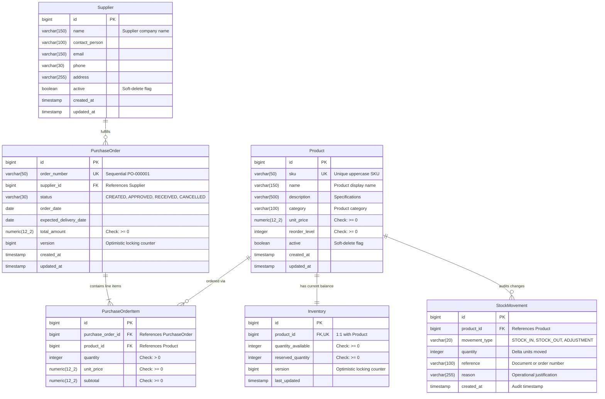

# FactoryOS — Database Design & Entity Relationships

## 1. Entity-Relationship Diagram (ERD)

---

## 2. Relational Design Rationale

### 1. Separation of `Product` and `Inventory`

- **Product Master Data**: Contains descriptive, slowly-changing catalog attributes (name, category, description, reorder thresholds, catalog price).
- **Inventory Balance**: Tracks volatile physical stock counts that change multiple times per day.
- **Why Separate?**: This enforces separation of concerns. Multiple warehouse locations or future multi-tenant inventory extensions can reference the same immutable `Product` master entity without altering the core catalog schema.

### 2. Separation of `Inventory` and `StockMovement`

- `Inventory` stores the **current materialized balance** (`quantity_available`). This allows O(1) instantaneous stock checks and low-stock queries.
- `StockMovement` stores an **append-only, immutable transaction log**. Rows are never updated or deleted; they record historical accountability for every unit increment, consumption, or physical count adjustment.

### 3. Junction Entity: `PurchaseOrderItem`

- A single purchase order can contain multiple distinct products, and a single product can be purchased across many orders over time (Many-to-Many).
- `PurchaseOrderItem` acts as the relational associative entity, capturing line-specific attributes:
  - `quantity`: Number of units ordered.
  - `unit_price`: The agreed price _at the moment of order placement_ (historical snapshot, protecting order totals if the product's catalog price changes later).
  - `subtotal`: Explicit line-item total (`quantity * unit_price`).

---

## 3. Database Constraints & Invariants

FactoryOS implements **defense-in-depth**: invariants are checked at both the Spring validation layer and the PostgreSQL database engine layer:

| Table                  | Constraint                     | Definition                                                   | Enforcement                 |
| :--------------------- | :----------------------------- | :----------------------------------------------------------- | :-------------------------- |
| `products`             | SKU Uniqueness                 | `uk_product_sku (sku)`                                       | Unique B-Tree Index         |
| `products`             | Non-negative price & threshold | `CHECK (unit_price >= 0 AND reorder_level >= 0)`             | PostgreSQL Table Constraint |
| `inventory`            | 1:1 Product Mapping            | `uk_inventory_product_id (product_id)`                       | Unique B-Tree Index         |
| `inventory`            | Non-negative Stock Balances    | `CHECK (quantity_available >= 0 AND reserved_quantity >= 0)` | PostgreSQL Table Constraint |
| `purchase_orders`      | Sequential Order Number        | `uk_purchase_order_number (order_number)`                    | Unique B-Tree Index         |
| `purchase_orders`      | Non-negative Total Amount      | `CHECK (total_amount >= 0)`                                  | PostgreSQL Table Constraint |
| `purchase_order_items` | Positive Quantity & Prices     | `CHECK (quantity > 0 AND unit_price >= 0 AND subtotal >= 0)` | PostgreSQL Table Constraint |
